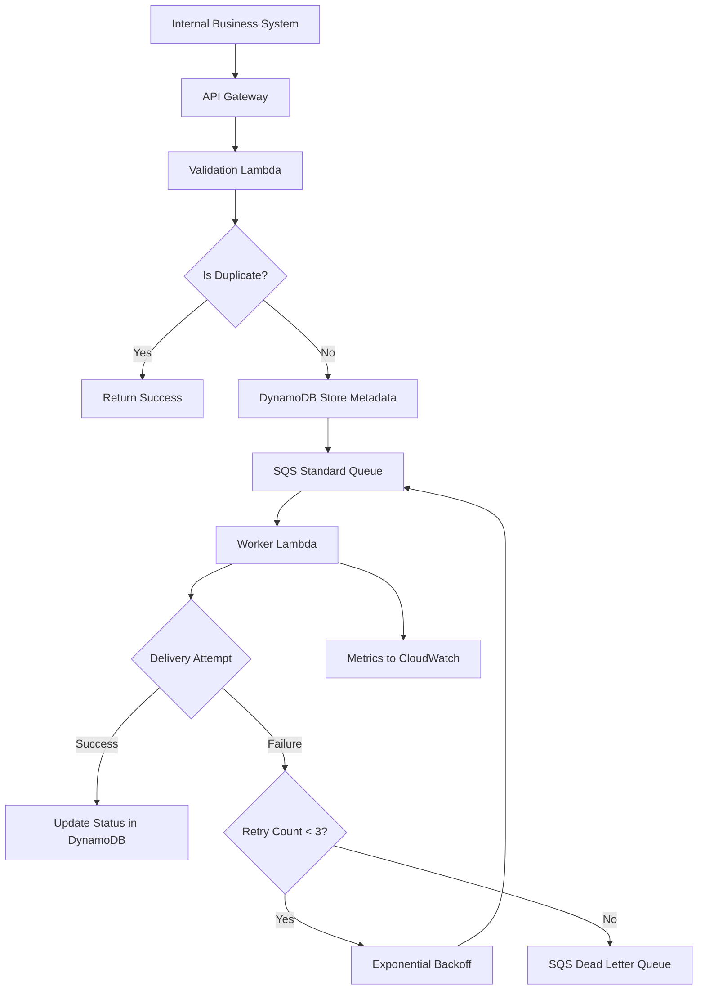

# API Notification System - Detailed Design

## Overview

The API Notification System is designed to provide a reliable, high-throughput mechanism for internal business systems to send HTTP notifications to external partner APIs. The system ensures exactly-once delivery guarantees while handling up to 100,000 notifications per second with acceptable latency. It abstracts the complexity of reliable delivery from business systems, allowing them to focus on their core logic while ensuring notifications are delivered stably to external partners.

Key characteristics:
- Exactly-once delivery semantics
- High throughput (100,000 notifications/second)
- Asynchronous processing with 10-second latency target
- Idempotent operations via client-provided message IDs
- Comprehensive error handling and retry mechanisms
- Dead letter queue for undeliverable messages
- Metrics collection for monitoring

## Detailed Requirements

### Functional Requirements
- Accept notification requests via internal HTTP API
- Validate request format and authentication
- Ensure idempotent processing using message ID + timestamp + sender ID + destination
- Queue notifications for asynchronous processing
- Attempt delivery to external APIs with retry logic
- Handle failures by moving to dead letter queue after max retries
- Provide metrics on delivery success/failure rates

### Non-Functional Requirements
- **Throughput**: Support 100,000 notifications per second
- **Latency**: Target 10 seconds from request acceptance to delivery attempt
- **Reliability**: Exactly-once delivery (no duplicates, no losses)
- **Availability**: High availability with health checks
- **Scalability**: Auto-scale to handle burst traffic
- **Security**: Internal authentication (e.g., AWS IAM)
- **Payload Limits**: 256KB default, with S3 support for larger payloads

### Edge Cases
- Large payloads (>256KB): Use S3 presigned URLs
- Slow/unresponsive external APIs: Move to DLQ after retries
- Network issues: Health checks and monitoring
- High concurrency: Asynchronous processing with queue buffering
- Malformed requests: Validation and error responses with metrics

## Architecture Overview

The system follows an event-driven architecture using serverless components for scalability:



Key components:
- **API Gateway**: Entry point for notification requests
- **Validation Lambda**: Input validation and authentication
- **DynamoDB**: Deduplication and message status storage
- **SQS Standard Queue**: Message buffering and delivery queue
- **Worker Lambda**: Actual HTTP delivery with retry logic
- **SQS DLQ**: Failed message storage
- **CloudWatch**: Metrics and monitoring

## Components and Interfaces

### API Interface
- **Endpoint**: `POST /message`
- **Authentication**: AWS IAM or similar internal auth
- **Request Body**:
```json
{
  "messageId": "string",
  "timestamp": "ISO8601",
  "senderId": "string",
  "targetUrl": "string",
  "method": "GET|POST|PUT|DELETE",
  "headers": {"key": "value"},
  "body": "string or presigned S3 URL"
}
```
- **Response**: `200 OK` for accepted, `4xx/5xx` for validation errors

### Internal Components

#### Validation Lambda
- Validates request format and required fields
- Checks authentication
- Performs initial deduplication check
- Returns immediate response to client

#### Deduplication Service (DynamoDB)
- Stores message metadata with TTL
- Prevents duplicate processing
- Tracks delivery status and attempts

#### Queue Service (SQS)
- Buffers messages for asynchronous processing
- Provides visibility timeout for processing
- Configured dead letter queue for failures

#### Worker Lambda
- Polls SQS for messages
- Executes HTTP requests to external APIs
- Implements retry logic with exponential backoff
- Updates status in DynamoDB
- Publishes metrics

## Data Models

### DynamoDB Message Table
```javascript
{
  partitionKey: "messageId#senderId",
  sortKey: "timestamp#targetUrl",
  status: "PENDING|PROCESSING|SUCCESS|FAILED",
  attempts: 0,
  lastAttempt: "ISO8601",
  error: "string",
  ttl: epochTimestamp
}
```

### SQS Message Format
```json
{
  "messageId": "string",
  "targetUrl": "string",
  "method": "string",
  "headers": {},
  "body": "string",
  "attempt": 1
}
```

## Error Handling

### Retry Strategy
- Maximum 3 delivery attempts
- Exponential backoff: base delay 1s, multiplier 2, max delay 60s
- Random jitter to prevent thundering herd
- Different error types not distinguished for simplicity

### Failure Scenarios
- Network timeouts: Retry with backoff
- 5xx responses: Retry
- 4xx responses: Immediate failure (client error)
- Payload too large: Use S3 upload API
- Malformed requests: Validation error response

### Dead Letter Queue
- Messages moved after 3 failed attempts
- Manual inspection and reprocessing possible
- Metrics collected for alerting

## Testing Strategy

### Unit Testing
- Component isolation tests
- Mock external API responses
- Deduplication logic validation
- Error handling scenarios

### Integration Testing
- End-to-end message flow
- SQS and DynamoDB interactions
- API Gateway to Lambda integration
- Cross-region failover (if applicable)

### Load Testing
- 100k+ messages per second simulation
- Burst traffic handling
- Resource utilization monitoring
- Auto-scaling verification

### Reliability Testing
- Network failure simulation
- External API unavailability
- Database connectivity issues
- Idempotency under failure conditions

## Appendices

### Technology Choices
- **AWS Lambda**: Serverless compute for auto-scaling and cost efficiency
- **Amazon SQS**: Reliable message queuing with DLQ support
- **Amazon DynamoDB**: High-performance NoSQL for deduplication and status tracking
- **Amazon API Gateway**: Managed API management with authentication
- **Amazon CloudWatch**: Metrics and monitoring
- **Amazon S3**: Large payload storage with presigned URLs

Rationale: Serverless architecture provides automatic scaling, high availability, and operational simplicity while meeting the 100k/s throughput requirement.

### Research Findings
No dedicated research phase was conducted. Technology choices are based on industry best practices for reliable, high-throughput message processing systems.

### Alternative Approaches Considered
- **Traditional web services**: Higher operational overhead, manual scaling
- **Custom message broker**: Increased development and maintenance complexity
- **Database polling**: Poor performance at high throughput
- **Synchronous processing**: Blocks clients, reduces reliability

The serverless queue-based approach was selected for its balance of reliability, performance, and operational simplicity.
